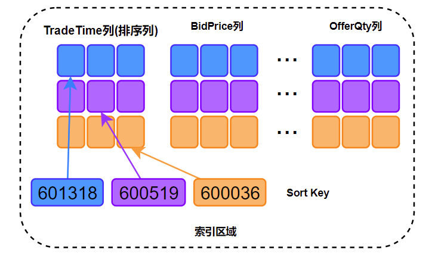

# SQL优化案例：深度不平衡、买卖压力指标、波动率计算

在金融行业的数据分析工作中，数据预处理及特征工程的质量往往决定了数学模型的实际效果。某些金融指标涉及原始大量数据中高维多列的复杂运算，这将耗费大量的计算资源和开发时间。本案例基于证券交易的level2快照数据，开发了10分钟频率的深度不平衡、买卖压力指标和波动率的计算脚本，旨在为DolphinDB使用者在开发其他类似因子计算脚本时提供参考范例，提高开发效率。

**优化前后计算效率**

* 分布式表数据总量：2,874,861,174
* 上证50指数的成分股数据量：58,257,708
* 处理后的结果表数据量：267,490

| 存储引擎 | 十档买卖量价存储方式 | 计算对象 | 逻辑CPU核数 | 计算耗时（s） |
| -------- | -------------------- | -------- | ----------- | ------------- |
| OLAP     | 40列                 | 列为单位 | 8           | 450           |
| OLAP     | 40列                 | 矩阵     | 8           | 450           |
| TSDB     | 40列                 | 矩阵     | 8           | 27            |
| TSDB     | 4列（array vector）  | 矩阵     | 8           | 25            |

本教程包含内容：

- [SQL优化案例：深度不平衡、买卖压力指标、波动率计算](#sql优化案例深度不平衡买卖压力指标波动率计算)
  - [1. Snapshot数据文件结构](#1-snapshot数据文件结构)
  - [2. 指标定义](#2-指标定义)
  - [3. SQL优化](#3-sql优化)
    - [3.1 新手：以列为单位进行计算](#31-新手以列为单位进行计算)
    - [3.2 进阶：将列拼接为矩阵进行计算](#32-进阶将列拼接为矩阵进行计算)
    - [3.3 高性能1：V2.00的TSDB存储和计算](#33-高性能1v200的tsdb存储和计算)
    - [3.4 高性能2：V2.00的TSDB使用Array Vector存储和计算](#34-高性能2v200的tsdb使用array-vector存储和计算)
  - [4. OLAP到TSDB的性能提升原因](#4-olap到tsdb的性能提升原因)
    - [4.1 数据库分区方法](#41-数据库分区方法)
    - [4.2 数据表创建方法](#42-数据表创建方法)
    - [4.3 OLAP存储引擎与TSDB存储引擎的差异](#43-olap存储引擎与tsdb存储引擎的差异)
    - [4.4 小结](#44-小结)
  - [5. 总结](#5-总结)

## 1. Snapshot数据文件结构

| 字段         | 含义   | 字段               | 含义    | 字段                | 含义   |
|------------|------|------------------|-------|-------------------|------|
| SecurityID | 证券代码 | LowPx            | 最低价   | BidPrice[10]      | 申买十价 |
| DateTime   | 日期时间 | LastPx           | 最新价   | BidOrderQty[10]   | 申买十量 |
| PreClosePx | 昨收价  | TotalVolumeTrade | 成交总量  | OfferPrice[10]    | 申卖十价 |
| OpenPx     | 开始价  | TotalValueTrade  | 成交总金额 | OfferOrderQty[10] | 申卖十量 |
| HighPx     | 最高价  | InstrumentStatus | 交易状态  | ……                | ……   |

本案例用到的字段为Snapshot中的部分字段，包括: 股票代码、快照时间、申买十价，申买十量，申卖十价，申卖十量。

样本为2020年上证50指数的成分股：

* 股票代码

  ```tex
  601318,600519,600036,600276,601166,600030,600887,600016,601328,601288,
  600000,600585,601398,600031,601668,600048,601888,600837,601601,601012,
  603259,601688,600309,601988,601211,600009,600104,600690,601818,600703,
  600028,601088,600050,601628,601857,601186,600547,601989,601336,600196,
  603993,601138,601066,601236,601319,603160,600588,601816,601658,600745
  ```

* 股票名称

  ```tex
  中国平安、贵州茅台、招商银行、恒瑞医药、兴业银行、中信证券、伊利股份、民生银行、交通银行、农业银行、
  浦发银行、海螺水泥、工商银行、三一重工、中国建筑、保利地产、中国中免、海通证券、中国太保、隆基股份、
  药明康德、华泰证券、万华化学、中国银行、国泰君安、上海机场、上汽集团、海尔智家、光大银行、三安光电、
  中国石化、中国神华、中国联通、中国人寿、中国石油、中国铁建、山东黄金、中国重工、新华保险、复星医药、
  洛阳钼业、工业富联、中信建投、红塔证券、中国人保、汇顶科技、用友网络、京沪高铁、邮储银行、闻泰科技
  ```

2020年上交所14460个证券的Snapshot数据已经提前导入至DolphinDB数据库中，一共约28.75亿条快照数据，导入方法见[股票行情数据导入实例](../应用场景示例/stockdata_csv_import_demo.md)，一共174列。


## 2. 指标定义

* **Weighted Averaged Price(WAP)**：加权平均价格


* **Depth Imbalance(DI)**：深度不平衡


* **Press**：买卖压力指标

}}{{\sum\limits_{j=0}^9WAP\div({Price_j}-WAP)}})


-\log(AskPress))

**特征数据重采样（10min窗口，并聚合计算波动率）**

重采样利用```group by SecurityID, interval( TradeTime, 10m, "none" )```方法

* **Realized Volatility(RV)**：波动率定义为对数收益率的平方和的平方根


股票的价格始终是处于买单价和卖单价之间，因此本项目用加权平均价格来代替股价进行计算


## 3. SQL优化
这些指标的计算SQL语句由以下几部分组成：

```sql
SELECT 指标计算函数(参数)
FROM 数据源
WHERE 日期筛选条件,股票筛选条件,交易时间筛选条件
GROUP BY 股票代码, interval(时间列,时间单位,缺失值填充方式)
```

本教程的优化部分为指标计算函数的处理过程。

### 3.1 新手：以列为单位进行计算

数据采用OLAP存储引擎存储。

根据指标定义公式，以列为单位进行计算，开发者能够快速写出以下SQL代码：
```sql
/**
part1: Define calculation function
*/
def calPress(BidPrice0,BidPrice1,BidPrice2,BidPrice3,BidPrice4,BidPrice5,BidPrice6,BidPrice7,BidPrice8,BidPrice9,BidOrderQty0,BidOrderQty1,BidOrderQty2,BidOrderQty3,BidOrderQty4,BidOrderQty5,BidOrderQty6,BidOrderQty7,BidOrderQty8,BidOrderQty9,OfferPrice0,OfferPrice1,OfferPrice2,OfferPrice3,OfferPrice4,OfferPrice5,OfferPrice6,OfferPrice7,OfferPrice8,OfferPrice9,OfferOrderQty0,OfferOrderQty1,OfferOrderQty2,OfferOrderQty3,OfferOrderQty4,OfferOrderQty5,OfferOrderQty6,OfferOrderQty7,OfferOrderQty8,OfferOrderQty9){
	WAP = (BidPrice0*OfferOrderQty0+OfferPrice0*BidOrderQty0)\(BidOrderQty0+OfferOrderQty0)
	Bid_1_P_WAP_SUM = 1\(BidPrice0-WAP) + 1\(BidPrice1-WAP) + 1\(BidPrice2-WAP) + 1\(BidPrice3-WAP) + 1\(BidPrice4-WAP) + 1\(BidPrice5-WAP) + 1\(BidPrice6-WAP) + 1\(BidPrice7-WAP) + 1\(BidPrice8-WAP) + 1\(BidPrice9-WAP)
	Offer_1_P_WAP_SUM = 1\(OfferPrice0-WAP)+1\(OfferPrice1-WAP)+1\(OfferPrice2-WAP)+1\(OfferPrice3-WAP)+1\(OfferPrice4-WAP)+1\(OfferPrice5-WAP)+1\(OfferPrice6-WAP)+1\(OfferPrice7-WAP)+1\(OfferPrice8-WAP)+1\(OfferPrice9-WAP)
	BidPress = BidOrderQty0*((1\(BidPrice0-WAP))\Bid_1_P_WAP_SUM) + BidOrderQty1*((1\(BidPrice1-WAP))\Bid_1_P_WAP_SUM) + BidOrderQty2*((1\(BidPrice2-WAP))\Bid_1_P_WAP_SUM) + BidOrderQty3*((1\(BidPrice3-WAP))\Bid_1_P_WAP_SUM) + BidOrderQty4*((1\(BidPrice4-WAP))\Bid_1_P_WAP_SUM) + BidOrderQty5*((1\(BidPrice5-WAP))\Bid_1_P_WAP_SUM) + BidOrderQty6*((1\(BidPrice6-WAP))\Bid_1_P_WAP_SUM) + BidOrderQty7*((1\(BidPrice7-WAP))\Bid_1_P_WAP_SUM) + BidOrderQty8*((1\(BidPrice8-WAP))\Bid_1_P_WAP_SUM) + BidOrderQty9*((1\(BidPrice9-WAP))\Bid_1_P_WAP_SUM)
	OfferPress = OfferOrderQty0*((1\(OfferPrice0-WAP))\Offer_1_P_WAP_SUM) + OfferOrderQty1*((1\(OfferPrice1-WAP))\Offer_1_P_WAP_SUM) + OfferOrderQty2*((1\(OfferPrice2-WAP))\Offer_1_P_WAP_SUM) + OfferOrderQty3*((1\(OfferPrice3-WAP))\Offer_1_P_WAP_SUM) + OfferOrderQty4*((1\(OfferPrice4-WAP))\Offer_1_P_WAP_SUM) + OfferOrderQty5*((1\(OfferPrice5-WAP))\Offer_1_P_WAP_SUM) + OfferOrderQty6*((1\(OfferPrice6-WAP))\Offer_1_P_WAP_SUM) + OfferOrderQty7*((1\(OfferPrice7-WAP))\Offer_1_P_WAP_SUM) + OfferOrderQty8*((1\(OfferPrice8-WAP))\Offer_1_P_WAP_SUM) + OfferOrderQty9*((1\(OfferPrice9-WAP))\Offer_1_P_WAP_SUM)
	return log(BidPress)-log(OfferPress)
}

/**
part2: Define variables and assign values
*/
stockList=`601318`600519`600036`600276`601166`600030`600887`600016`601328`601288`600000`600585`601398`600031`601668`600048`601888`600837`601601`601012`603259`601688`600309`601988`601211`600009`600104`600690`601818`600703`600028`601088`600050`601628`601857`601186`600547`601989`601336`600196`603993`601138`601066`601236`601319`603160`600588`601816`601658`600745
dbName = "dfs://snapshot_SH_L2_OLAP"
tableName = "snapshot_SH_L2_OLAP"
snapshot = loadTable(dbName, tableName)

/**
part3: Execute SQL
*/
result = select
            avg((OfferPrice0\BidPrice0-1)) as BAS,
            avg((BidOrderQty0-OfferOrderQty0)\(BidOrderQty0+OfferOrderQty0)) as DI0,
            avg((BidOrderQty1-OfferOrderQty1)\(BidOrderQty1+OfferOrderQty1)) as DI1,
            avg((BidOrderQty2-OfferOrderQty2)\(BidOrderQty2+OfferOrderQty2)) as DI2,
            avg((BidOrderQty3-OfferOrderQty3)\(BidOrderQty3+OfferOrderQty3)) as DI3,
            avg((BidOrderQty4-OfferOrderQty4)\(BidOrderQty4+OfferOrderQty4)) as DI4,
            avg((BidOrderQty5-OfferOrderQty5)\(BidOrderQty5+OfferOrderQty5)) as DI5,
            avg((BidOrderQty6-OfferOrderQty6)\(BidOrderQty6+OfferOrderQty6)) as DI6,
            avg((BidOrderQty7-OfferOrderQty7)\(BidOrderQty7+OfferOrderQty7)) as DI7,
            avg((BidOrderQty8-OfferOrderQty8)\(BidOrderQty8+OfferOrderQty8)) as DI8,
            avg((BidOrderQty9-OfferOrderQty9)\(BidOrderQty9+OfferOrderQty9)) as DI9,
            avg(calPress(BidPrice0,BidPrice1,BidPrice2,BidPrice3,BidPrice4,BidPrice5,BidPrice6,BidPrice7,BidPrice8,BidPrice9, BidOrderQty0,BidOrderQty1,BidOrderQty2,BidOrderQty3,BidOrderQty4,BidOrderQty5,BidOrderQty6,BidOrderQty7,BidOrderQty8,BidOrderQty9,OfferPrice0,OfferPrice1,OfferPrice2,OfferPrice3,OfferPrice4,OfferPrice5,OfferPrice6,OfferPrice7,OfferPrice8,OfferPrice9,OfferOrderQty0,OfferOrderQty1,OfferOrderQty2,OfferOrderQty3,OfferOrderQty4,OfferOrderQty5,OfferOrderQty6,OfferOrderQty7,OfferOrderQty8,OfferOrderQty9)) as Press,
            sqrt(sum(pow((log((BidPrice0*OfferOrderQty0+OfferPrice0*BidOrderQty0)\(BidOrderQty0+OfferOrderQty0))-prev(log((BidPrice0*OfferOrderQty0+OfferPrice0*BidOrderQty0)\(BidOrderQty0+OfferOrderQty0)))),2))) as RV
		from snapshot
		where date(TradeTime) between 2020.01.01 : 2020.12.31, SecurityID in stockList, (time(TradeTime) between 09:30:00.000 : 11:29:59.999) || (time(TradeTime) between 13:00:00.000 : 14:56:59.999)
		group by SecurityID, interval( TradeTime, 10m, "none" ) as TradeTime
```

上述SQL中，涉及`BidPrice0-9`、`BidOrderQty0-9`、`OfferPrice0-9`、`OfferOrderQty0-9`共40列数据，且由于指标定义较为复杂，即使公式化简后，仍然难以解决代码冗长、修改困难的问题。

计算处理效率：

* 分布式表数据总量：2,874,861,174
* 上证50指数的成分股数据量：58,257,708
* 逻辑CPU核数：8
* 平均占用CPU核心数：4.5个
* 耗时：450秒

### 3.2 进阶：将列拼接为矩阵进行计算

数据采用OLAP存储引擎存储。

上述公式定义中都是列与列之间的计算，实际计算往往发生在`BidPrice`，`BidOrderQty`，`OfferPrice`，`OfferOrderQty`这4个大组之间（每组10列），因此可以将这四个大组看成n行10列的矩阵。在SQL中进行matrix拼接，再传入聚合函数中进行矩阵运算，示例代码如下：

```sql
/**
part1: Define calculation function
*/
defg featureEngine(bidPrice,bidQty,offerPrice,offerQty){
	bas = offerPrice[0]\bidPrice[0]-1
	wap = (bidPrice[0]*offerQty[0] + offerPrice[0]*bidQty[0])\(bidQty[0]+offerQty[0])
	di = (bidQty-offerQty)\(bidQty+offerQty)
	bidw=(1.0\(bidPrice-wap))
	bidw=bidw\(bidw.rowSum())
	offerw=(1.0\(offerPrice-wap))
	offerw=offerw\(offerw.rowSum())
	press=log((bidQty*bidw).rowSum())-log((offerQty*offerw).rowSum())
	rv=sqrt(sum2(log(wap)-log(prev(wap))))
	return avg(bas),avg(di[0]),avg(di[1]),avg(di[2]),avg(di[3]),avg(di[4]),avg(di[5]),avg(di[6]),avg(di[7]),avg(di[8]),avg(di[9]),avg(press),rv
}

/**
part2: Define variables and assign values
*/
stockList=`601318`600519`600036`600276`601166`600030`600887`600016`601328`601288`600000`600585`601398`600031`601668`600048`601888`600837`601601`601012`603259`601688`600309`601988`601211`600009`600104`600690`601818`600703`600028`601088`600050`601628`601857`601186`600547`601989`601336`600196`603993`601138`601066`601236`601319`603160`600588`601816`601658`600745
dbName = "dfs://snapshot_SH_L2_OLAP"
tableName = "snapshot_SH_L2_OLAP"
snapshot = loadTable(dbName, tableName)

/**
part3: Execute SQL
*/
result1 = select
            featureEngine(
            matrix(BidPrice0,BidPrice1,BidPrice2,BidPrice3,BidPrice4,BidPrice5,BidPrice6,BidPrice7,BidPrice8,BidPrice9),
            matrix(BidOrderQty0,BidOrderQty1,BidOrderQty2,BidOrderQty3,BidOrderQty4,BidOrderQty5,BidOrderQty6,BidOrderQty7, BidOrderQty8,BidOrderQty9),
            matrix(OfferPrice0,OfferPrice1,OfferPrice2,OfferPrice3,OfferPrice4,OfferPrice5,OfferPrice6,OfferPrice7,OfferPrice8, OfferPrice9),
            matrix(OfferOrderQty0,OfferOrderQty1,OfferOrderQty2,OfferOrderQty3,OfferOrderQty4,OfferOrderQty5,OfferOrderQty6, OfferOrderQty7,OfferOrderQty8,OfferOrderQty9)) as `BAS`DI0`DI1`DI2`DI3`DI4`DI5`DI6`DI7`DI8`DI9`Press`RV
		from snapshot
		where date(TradeTime) between 2020.01.01 : 2020.12.31, SecurityID in stockList, (time(TradeTime) between 09:30:00.000 : 11:29:59.999) || (time(TradeTime) between 13:00:00.000 : 14:56:59.999)
		group by SecurityID, interval( TradeTime, 10m, "none" ) as TradeTime map
```

通过矩阵化处理，代码大量减少，且在自定义聚合函数中已经可以比较容易的看出指标公式的计算代码，这将极大地方便后续公式定义和指标计算代码的修改。

计算处理效率：

* 分布式表数据总量：2,874,861,174
* 上证50指数的成分股数据量：58,257,708
* 逻辑CPU核数：8
* 平均占用CPU核心数：4.5个
* 耗时：450秒

### 3.3 高性能1：V2.00的TSDB存储和计算

DolphinDB V2.00新增了TSDB存储引擎，在创建分区数据库和表时与OLAP存储引擎的不同之处是必须指定`engine`和`sortColumns`，创建语句如下：
```sql
dbName = "dfs://snapshot_SH_L2_TSDB"
tableName = "snapshot_SH_L2_TSDB"
dbTime = database(, VALUE, 2020.01.01..2020.12.31)
dbSymbol = database(, HASH, [SYMBOL, 20])
db = database(dbName, COMPO, [dbTime, dbSymbol], engine='TSDB')
createPartitionedTable(dbHandle=db, table=tbTemp, tableName=tableName, partitionColumns=`TradeTime`SecurityID, sortColumns=`SecurityID`TradeTime)
```

计算代码与3.2进阶代码完全相同。

由于TSDB存储引擎的查询优化，数据计算性能得到了极大地提升。原来需要运行450秒完成的计算，优化后只需运行27秒，计算速度是未优化代码的17倍。

计算处理效率：

* 分布式表数据总量：2,874,861,174
* 上证50指数的成分股数据量：58,257,708
* 逻辑CPU核数：8
* 平均占用CPU核心数：7.6个
* 无level file index cache下的计算耗时：27秒
* 有level file index cache下的计算耗时：16秒

### 3.4 高性能2：V2.00的TSDB使用Array Vector存储和计算

DolphinDB从V2.00.4开始，分布式表的存储支持[数组向量（array vector）](https://www.dolphindb.cn/cn/help/200/DataTypesandStructures/DataForms/Vector/arrayVector.html)，因此在数据存储时可以把`BidPrice0-9`、`BidOrderQty0-9`、`OfferPrice0-9`、`OfferOrderQty0-9`共40列数据以array vector形式存储为`BidPrice`、`BidOrderQty`、`OfferPrice`、`OfferOrderQty`4列，SQL的示例代码如下：

```sql
/**
part1: Define calculation function
*/
defg featureEngine(bidPrice,bidQty,offerPrice,offerQty){
	bas = offerPrice[0]\bidPrice[0]-1
	wap = (bidPrice[0]*offerQty[0] + offerPrice[0]*bidQty[0])\(bidQty[0]+offerQty[0])
	di = (bidQty-offerQty)\(bidQty+offerQty)
	bidw=(1.0\(bidPrice-wap))
	bidw=bidw\(bidw.rowSum())
	offerw=(1.0\(offerPrice-wap))
	offerw=offerw\(offerw.rowSum())
	press=log((bidQty*bidw).rowSum())-log((offerQty*offerw).rowSum())
	rv=sqrt(sum2(log(wap)-log(prev(wap))))
	return avg(bas),avg(di[0]),avg(di[1]),avg(di[2]),avg(di[3]),avg(di[4]),avg(di[5]),avg(di[6]),avg(di[7]),avg(di[8]),avg(di[9]),avg(press),rv
}

/**
part2: Define variables and assign values
*/
stockList=`601318`600519`600036`600276`601166`600030`600887`600016`601328`601288`600000`600585`601398`600031`601668`600048`601888`600837`601601`601012`603259`601688`600309`601988`601211`600009`600104`600690`601818`600703`600028`601088`600050`601628`601857`601186`600547`601989`601336`600196`603993`601138`601066`601236`601319`603160`600588`601816`601658`600745
dbName = "dfs://snapshot_SH_L2_TSDB_ArrayVector"
tableName = "snapshot_SH_L2_TSDB_ArrayVector"
snapshot = loadTable(dbName, tableName)

/**
part3: Execute SQL
*/
result = select
		featureEngine(BidPrice,BidOrderQty,OfferPrice,OfferOrderQty) as `BAS`DI0`DI1`DI2`DI3`DI4`DI5`DI6`DI7`DI8`DI9`Press`RV
		from snapshot
		where date(TradeTime) between 2020.01.01 : 2020.12.31, SecurityID in stockList, (time(TradeTime) between 09:30:00.000 : 11:29:59.999) || (time(TradeTime) between 13:00:00.000 : 14:56:59.999)
		group by SecurityID, interval( TradeTime, 10m, "none" ) as TradeTime map
```

使用TSDB的array vector进行数据存储，在性能上相较于TSDB的分列存储提升不明显，但是代码更加精简，方便后期的修改和维护。

计算效率：

* 分布式表数据总量：2,874,861,174
* 上证50指数的成分股数据量：58,257,708
* 逻辑CPU核数：8
* 平均占用CPU核心数：7.6个
* 无level file索引缓存下的计算耗时：25秒
* 有level file索引缓存下的计算耗时：15秒

## 4. OLAP到TSDB的性能提升原因

### 4.1 数据库分区方法

OLAP存储引擎创建分区数据库的代码：

```sql
dbName = "dfs://snapshot_SH_L2_OLAP"
dbTime = database(, VALUE, 2020.01.01..2020.12.31)
dbSymbol = database(, HASH, [SYMBOL, 20])
db = database(dbName, COMPO, [dbTime, dbSymbol])
```

TSDB存储引擎创建分区数据库的代码：

```sql
dbName = "dfs://snapshot_SH_L2_TSDB"
dbTime = database(, VALUE, 2020.01.01..2020.12.31)
dbSymbol = database(, HASH, [SYMBOL, 20])
db = database(dbName, COMPO, [dbTime, dbSymbol], engine='TSDB')
```

DolphinDB的分区规则是建立在数据库层面上的，本案例中，OLAP存储引擎和TSDB存储引擎的分区规则相同，第一层按天分区，第二层以证券代码采用哈希算法分20个区。因此，14460个证券每天的数据被相对均匀地存储在20个分区内，上证50指数成分股的数据也被分散存储在多个分区内；从另一个角度理解，同一个分区内包含多个哈希值相同的证券的数据。

在DolphinDB中，无论是OLAP存储引擎还是TSDB存储引擎，数据的切片思想和算法是一致的，所以本案例中，数据库创建代码中唯一的差异是，TSDB存储引擎需要指定参数`engine`为`TSDB`，该参数默认值是`OLAP`。

### 4.2 数据表创建方法

OLAP存储引擎创建分区数据表的代码：

```sql
dbName = "dfs://snapshot_SH_L2_OLAP"
db = database(dbName)
tableName = "snapshot_SH_L2_OLAP"
createPartitionedTable(dbHandle=db, table=tbTemp, tableName=tbName, partitionColumns=`TradeTime`SecurityID)
```

TSDB存储引擎创建分区数据表的代码：

```sql
dbName = "dfs://snapshot_SH_L2_TSDB"
db = database(dbName)
tableName = "snapshot_SH_L2_TSDB"
createPartitionedTable(dbHandle=db, table=tbTemp, tableName=tableName, partitionColumns=`TradeTime`SecurityID, sortColumns=`SecurityID`TradeTime)
```

在使用[DolphinDB V2.00 TSDB存储引擎](https://www.dolphindb.cn/cn/help/200/DatabaseandDistributedComputing/Database/DataModel.html)创建分区数据表时，设置了```sortColumns=`SecurityID`TradeTime```，`sortColumns`一般由两部分组成：

* `sortKey`：可以由一个或多个查询索引列组成，不包含数据的时间列
* 时间列：数据中的时间列，作为分区内数据按时间顺序的排序列

本案例中，```sortKey=`SecurityID```，时间列为`TradeTime`。与OLAP存储引擎相比，TSDB存储的每个分区中的同一`SecurityID`的数据在磁盘文件中是连续的，且按照`TradeTime`严格排序。相比于OLAP存储引擎，TSDB存储引擎在根据`sortColumes`字段进行数据过滤查询时，可以根据分区内的索引文件从磁盘上只加载满足过滤条件的数据。

本案例的计算样本是2020年上证50指数成分股，计算数据源是2020年上交所14460个证券的全部数据。如果采用OLAP存储引擎，需要将上证50指数成分股涉及的分区内的无关证券的数据同时从磁盘上加载到内存后，进行数据的解压、过滤和计算操作。如果采用TSDB，只需要将上证50指数成分股的数据从磁盘上加载到内存，进行数据的计算操作。

### 4.3 OLAP存储引擎与TSDB存储引擎的差异

OLAP存储引擎保持了数据写入时的顺序，以一种append-only的方式往磁盘上存储数据。分区表的每个分区内的每个列是一个文件，对于某个列文件而言，多个`SecurityID`的数据是根据数据写入顺序添加到文件中的，所以同一个`SecurityID`的数据很大概率是散乱地分布在整个列文件的各个位置。本案例中，查询数据表存储了14460个证券的数据，虽然只查询上证50指数成分股的数据，但是在OLAP存储引擎下，会将上证50指数成分股涉及的分区内的无关证券的数据同时从磁盘上读取到内存进行解压，降低了数据提取的效率。

TSDB存储引擎设置了```sortColumns=`SecurityID`TradeTime```，对同一个`SecurityID`的数据的存储是连续的，且存储的时候需要压缩：

* 如果将同一个`SecurityID`的所有数据一起压缩，那每次查询的时候，即便真正需要查询的数据只是这个`SecurityID`全部数据的一小部分，仍然需要将所有的数据都从磁盘读到内存中以进行解压，降低数据读取效率。
* TSDB存储引擎的做法是将同一个`SecurityID`在同一个LevelFile里的全部数据一起压缩存储，并且指定一个时间区间以供查询，而这个时间区间内的数据只占据了这个`SecurityID`所有数据的一小部分。在本案例中，同一个`SecurityID`的数据根据`sortColumns`最后一列`TradeTime`排序，并将数据拆成一定大小（默认为16KB）的数据块（block）来存储。在读取数据的时候，TSDB根据查询语句中的股票列和时间列过滤条件先快速定位到满足过滤条件的数据块，再将这些数据块读到内存里进行解压，而这些数据块通常只占所有数据的一小部分，这样就可以大大提升查询的效率。




### 4.4 小结

本案例中，使用TSDB存储引擎比OLAP存储引擎计算性能提升的主要原因如下：

* 本案例计算场景中，查询数据表中存储了上交所2020年所有证券的level2快照数据，14460个证券共2,874,861,174条数据。计算的样本数据为2020年上证50指数的成分股，共58,257,708条数据。在没有任何缓存的前提下，与OLAP存储引擎相比，TSDB存储引擎仅仅只需要去磁盘上读取58,257,708条数据。

* DolphinDB从V2.00.4开始，分布式表的存储支持[数组向量（array vector）](https://www.dolphindb.cn/cn/help/200/DataTypesandStructures/DataForms/Vector/arrayVector.html)，特别适用于金融快照数据多档量价数据的存储。针对上交所level2快照数据，采用array vector存储后，压缩比可以提升到9~11。在没有任何缓存的前提下，与多列存储方案相比，采用TSDB的array vector存储后，单位时间内从磁盘上读取的数据条数提升。

* level2快照数据中的多档量价数据采用[DolphinDB2.00TSDB存储引擎](https://www.dolphindb.cn/cn/help/200/DatabaseandDistributedComputing/Database/DataModel.html)的array vector存储后，从某种意义上实现了数据的三维存储，即在分布式表的某列某行中存储了一个[向量](https://www.dolphindb.cn/cn/help/200/DataTypesandStructures/DataForms/Vector/index.html)对象，所以在对多档量价数据做矩阵运算时，取某一列的多行数据返回的对象就是一个矩阵，与多列存储方案相比，省去了矩阵拼接的过程。

## 5. 总结

本案例基于同一个计算场景，开发了4份SQL代码：

* **新手篇**代码数据存储采用DolphinDB的OLAP存储引擎，基于列式计算思想，代码开发难度简单，但是存在代码冗长、修改困难的问题，计算时间为450秒。
* **进阶篇**代码数据存储采用DolphinDB的OLAP存储引擎，基于矩阵计算思想，代码开发难度一般，代码量减少，计算逻辑表达更加清晰，计算耗时为450秒。
* **高性能1篇**代码数据存储采用DolphinDB的TSDB存储引擎，基于矩阵计算思想，脚本代码与进阶篇代码完全相同，无level file索引缓存下计算耗时为27秒，有level file索引缓存下计算耗时为16秒。
* **高性能2篇**代码数据存储采用DolphinDB的TSDB存储引擎，且多档量价数据采用[array vector](https://www.dolphindb.cn/cn/help/200/DataTypesandStructures/DataForms/Vector/arrayVector.html)进行存储，基于矩阵计算思想，代码精简，方便后期的修改和维护，无level file索引缓存下计算耗时为25秒，有level file索引缓存下计算耗时为15秒。

旨在为DolphinDB使用者在开发其他类似因子计算脚本时提供参考范例，提高开发效率。
